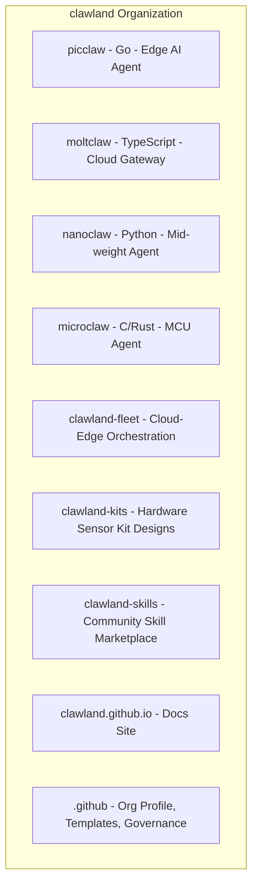
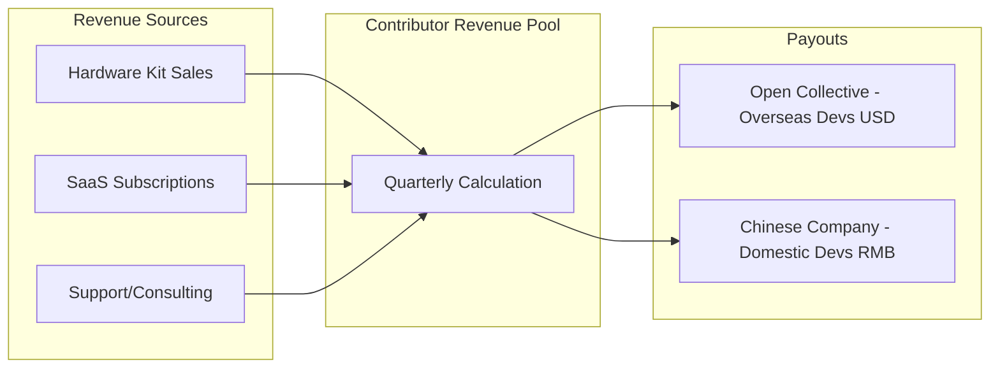

# Clawland 开源组织 + 核心开发者利润分享方案

## 一、GitHub 组织结构

组织名: **github.com/clawland**




### 各仓库定位

- **picclaw**: 极致轻量边缘 Agent (Go), <10MB RAM, $10 硬件
- **moltclaw**: 全功能云端 AI 网关 (TypeScript), 多 Agent 路由
- **nanoclaw**: 中等量级 Agent (Python), Python 生态丰富
- **microclaw**: MCU 级超微 Agent (C/Rust), $2-5 传感器级
- **clawland-fleet**: 云边协同编排系统 (Edge API + Reporter + Fleet Manager)
- **clawland-kits**: 硬件套件设计 (BOM + 接线图 + 传感器驱动脚本 + 预装镜像)
- **clawland-skills**: 社区技能市场 (每个 Skill 一个目录, 按场景分类)
- **clawland.github.io**: 官网 + 文档 (场景展示 + 快速入门 + API 文档)
- **.github**: 组织 profile, Issue/PR 模板, GOVERNANCE.md, CODE_OF_CONDUCT.md

---

## 二、开源许可证策略（双轨制）

核心原则: **核心代码足够开放以吸引开发者, 商业增值部分受保护以支撑利润分享**


| 仓库                 | 许可证                       | 理由                      |
| ------------------ | ------------------------- | ----------------------- |
| picclaw            | Apache 2.0                | 最大限度吸引开发者, 允许商用, 专利保护   |
| moltclaw           | Apache 2.0                | 同上                      |
| nanoclaw           | Apache 2.0                | 同上                      |
| microclaw          | Apache 2.0                | 同上                      |
| clawland-fleet     | BSL 1.1 (4年后转 Apache 2.0) | 保护云端编排/SaaS 收入, 4年后完全开源 |
| clawland-kits      | CERN-OHL-S-2.0            | 开源硬件标准许可, 鼓励硬件社区参与      |
| clawland-skills    | MIT                       | 最宽松, 鼓励社区贡献技能           |
| clawland.github.io | CC BY-SA 4.0              | 文档标准许可                  |


**BSL 1.1 附加使用授权 (Additional Use Grant)**:

> 允许非竞争性的生产环境使用。禁止将本软件作为托管服务直接与 Clawland 官方 SaaS 竞争。4 年后自动转为 Apache 2.0。

这意味着: 开发者可以自由使用 fleet 代码部署自己的私有云边系统, 但不能直接拿去做一个一模一样的 SaaS 卖给别人。

---

## 三、利润分享模型 -- "Contributor Revenue Pool"

### 3.1 模型概览




**收入分配比例**:


| 分配项                          | 比例      | 说明        |
| ---------------------------- | ------- | --------- |
| 运营成本 (硬件采购/服务器/LLM API)      | ~40-50% | 可变成本, 按实际 |
| 公司储备 (研发/市场/法务)              | 25-30%  | 公司持续发展    |
| **Contributor Revenue Pool** | **20%** | 核心开发者分享   |
| 社区基金 (Bounties/活动/文档)        | 5%      | 社区发展      |


**核心数字**: 净收入 (Revenue - COGS) 的 **20%** 进入 Contributor Pool, 按季度分配。

### 3.2 贡献者层级


| 层级                        | 条件                      | 权益                              |
| ------------------------- | ----------------------- | ------------------------------- |
| **Core Maintainer**       | TSC 投票通过, 持续 6 个月+ 核心贡献 | Revenue Pool 分配 + 技术决策权 + 路线图投票 |
| **Active Contributor**    | 连续 3 个月有合并的 PR          | Revenue Pool 分配 (按贡献分计算)        |
| **Community Contributor** | 任何被合并的 PR               | Bounty 奖励 + 社区基金支持              |


### 3.3 贡献积分系统 (Contribution Points)

每季度统计, 使用 GitHub API 自动化采集 + 人工校准:


| 贡献类型                    | 基础分        | 乘数规则                           |
| ----------------------- | ---------- | ------------------------------ |
| 代码合并 (PR merged)        | 10 分/PR    | 核心模块 x2, Bug fix x1.5, 文档 x0.8 |
| 代码审查 (Review)           | 3 分/Review | 深度审查 (带建议的) x2                 |
| Issue 报告 (有效)           | 2 分/Issue  | 含复现步骤 x1.5, 安全漏洞 x3            |
| Skill 贡献                | 15 分/Skill | 含测试用例 x1.5                     |
| 硬件套件设计                  | 20 分/Kit   | 含测试报告 x1.5                     |
| 文档/教程                   | 5 分/篇      | 多语言 x1.5                       |
| 社区支持 (Discord/Issue 解答) | 1 分/次      | Core Maintainer 认定的高质量回答 x3    |


**季度分配公式**:

```
个人分配 = Pool 总额 x (个人积分 / 所有参与者积分总和)
```

**示例**: 季度 Pool = $10,000, 三位核心开发者积分分别为 500, 300, 200

- 开发者 A: $10,000 x 500/1000 = $5,000
- 开发者 B: $10,000 x 300/1000 = $3,000
- 开发者 C: $10,000 x 200/1000 = $2,000

### 3.4 透明化机制

- **Open Collective**: 海外开发者通过 Open Collective 接收分配, 所有收支对社区公开可见
- **季度报告**: 发布在 `.github` 仓库的 `reports/` 目录, 包含:
  - 本季度总收入 (按产品线分)
  - Pool 总额
  - 每位贡献者的积分明细和分配金额
  - 下季度目标和预算
- **GitHub Discussions**: 每季度一个 Discussion thread, 社区可质疑/讨论分配

---

## 四、治理结构

### 4.1 Technical Steering Committee (TSC)

- 初始成员: 创始人 + 前 2-3 位 Core Maintainer
- 职责: 技术路线图, Core Maintainer 提名/投票, Revenue Pool 争议仲裁
- 决策方式: 多数票 (>50%), 重大决策需 2/3 通过
- 任期: 1 年, 可连任

### 4.2 决策流程

- **RFC (Request for Comments)**: 重大技术/治理变更需提交 RFC 到 `.github/rfcs/`
- **投票**: TSC 成员在 GitHub Discussion 中投票, 7 天投票期
- **紧急决策**: 安全漏洞等紧急事项, 任意 2 名 TSC 成员可快速决策

---

## 五、Contributor License Agreement (CLA)

所有贡献者需签署 CLA (使用 CLA Assistant bot 自动化):

核心条款:

- 贡献者保留代码版权
- 授予 Clawland 永久、不可撤销的使用许可 (包括商业用途)
- Clawland 承诺将产品收入的约定比例 (20%) 分配给贡献者
- 贡献者同意遵守行为准则

---

## 六、需要创建的关键文件

### 在 `.github` 仓库中:


| 文件                             | 内容                                                 |
| ------------------------------ | -------------------------------------------------- |
| `profile/README.md`            | Clawland 组织介绍, 项目矩阵, "Build the Edge AI Future" 口号 |
| `GOVERNANCE.md`                | TSC 章程, 决策流程, Core Maintainer 晋升标准                 |
| `CONTRIBUTOR-REVENUE-SHARE.md` | 利润分享完整规则, 积分体系, 分配公式, FAQ                          |
| `CLA.md`                       | 贡献者许可协议全文                                          |
| `CODE_OF_CONDUCT.md`           | 行为准则                                               |
| `CONTRIBUTING.md`              | 贡献指南 (适用于所有仓库)                                     |
| `reports/YYYY-QN.md`           | 季度透明度报告模板                                          |


### 在每个项目仓库中:


| 文件                                 | 内容                                                  |
| ---------------------------------- | --------------------------------------------------- |
| `LICENSE`                          | 对应的许可证文件                                            |
| `CONTRIBUTING.md`                  | 项目特定贡献指南 (链接到组织级文档)                                 |
| `.github/ISSUE_TEMPLATE/`          | Bug report, Feature request, Sensor kit proposal 模板 |
| `.github/PULL_REQUEST_TEMPLATE.md` | PR 模板                                               |


---

## 七、吸引开发者的策略

1. **"Build to Earn"** 口号: 不是捐赠, 是真正的利润分享 -- 你的代码产生的收入, 你拿 20%
2. **First 10 Contributors** 计划: 前 10 位 Core Maintainer 额外获得 0.5% 终身固定分成 (不占 Pool)
3. **Bounty Board**: 在 GitHub Projects 中维护 Bounty 看板, 标明每个任务的预估奖金
4. **Good First Issue**: 每个仓库保持 5+ 个 `good-first-issue` 标签的 Issue
5. **Hardware Sponsor**: 向活跃贡献者免费寄送开发板和传感器套件
6. **场景 Demo 视频**: 录制真实场景部署视频 (鱼塘/机房/大棚) 展示 Picclaw 实际效果

---

## 八、实施步骤

Phase 1 (第 1 周): 创建 GitHub 组织 + 迁移 picclaw 仓库 + 创建 .github 仓库 + 写 GOVERNANCE.md 和 CONTRIBUTOR-REVENUE-SHARE.md

Phase 2 (第 2-3 周): 配置 CLA bot + Issue/PR 模板 + 创建 clawland-kits 仓库 (放入传感器套件设计) + 创建 clawland-skills 仓库

Phase 3 (第 4 周): 注册 Open Collective + 发布 "Build to Earn" 公告 + 创建 Bounty Board + 在 Reddit/HN/V2EX/掘金 发布项目介绍

Phase 4 (持续): 每季度发布透明度报告 + 维护 Bounty Board + 发展 Core Maintainer 团队